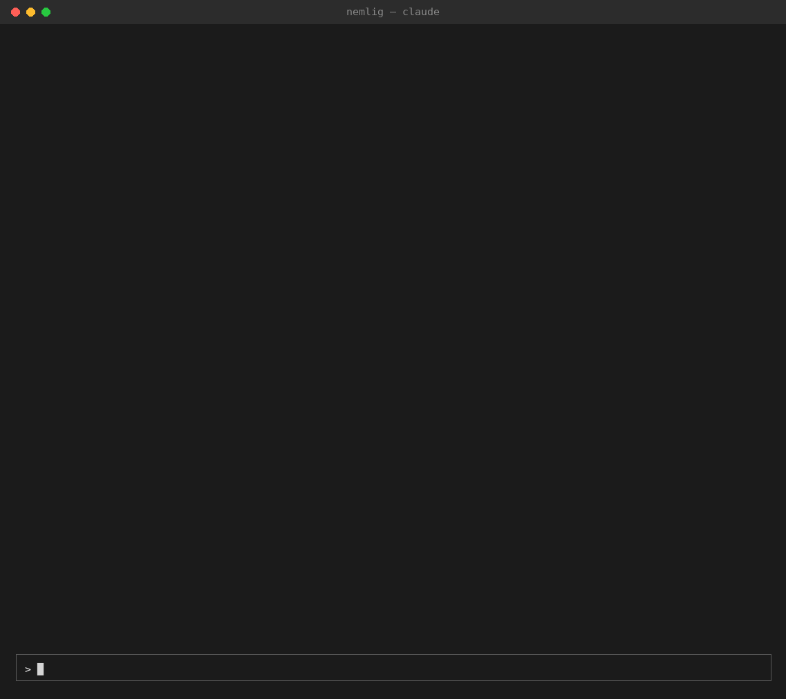

# nemlig

[](https://github.com/AndersMollgaard/nemlig/actions/workflows/test.yml)

Agent skills that do the weekly shop on [nemlig.com](https://www.nemlig.com), the Danish online
grocery store. Say "fill my basket" in Claude Code or Codex, and the agent restocks the items you
usually buy, plans dinners around this week's offers, proposes cheaper swaps, and writes a recipe
page for the nights. The skills are built on a `nemlig` command-line tool and a Python library,
and both work on their own.

Unofficial and not affiliated with nemlig.com. It uses your real account, and it may break when
the site changes. It fills the basket only: checkout always happens in the browser.

## What a run looks like

"Fill my basket. Delivery Friday. Two dinners." The agent reserves your usual Friday delivery
window, restocks what is due, and asks you twice: which offers to build the dinners on, and
which dishes. Then it reports once, with cheaper swaps for the whole basket, while a background
agent writes the recipe page.



A real run, sped up. The waits are shortened and the long command output is collapsed.

The recipe page that run wrote: [Week 41 Dinners](https://andersmollgaard.github.io/nemlig/example-recipes.html),
a card per night with what came from the basket, what you have at home, and steps you can tick
off while you cook.

## Requirements

- A nemlig.com account. nemlig.com delivers in Denmark only.
- [uv](https://docs.astral.sh/uv/) and Python 3.12 or newer.
- [Claude Code](https://claude.com/claude-code) or [OpenAI Codex](https://openai.com/codex) for
  the skills. The CLI and the library work without either.

## Setup

1. Clone the repo:
   ```sh
   git clone https://github.com/AndersMollgaard/nemlig.git && cd nemlig
   ```
2. Install the dependencies with `uv sync`.
3. Copy `.env.example` to `.env` and fill in your nemlig.com login, `NEMLIG_USER` and
   `NEMLIG_PASS`.
4. Run `uv run nemlig setup`. It links the skills where Codex finds them in the repo, and creates
   `preferences.toml`.
5. Start Claude Code or Codex in the clone and say "set me up". The `nemlig-setup` skill checks
   the login, asks about your household and writes the preferences, and reads your order
   history.

The shortcut: open Claude Code in the clone and ask it to set things up. The skill walks you
through the rest, except the password, which you type into `.env` yourself.

## The skills

The skills live in [`.claude/skills/`](.claude/skills). Each one triggers on what you ask for.

| Skill | What it does | Say |
| --- | --- | --- |
| [`nemlig-setup`](.claude/skills/nemlig-setup/SKILL.md) | First run: checks the install and the login, interviews you about the household (size, children, diet, what you always buy, budget), writes `preferences.toml`, syncs your past orders and reviews the product groups restock uses with you | "set me up", "get started" |
| [`nemlig-shopping`](.claude/skills/nemlig-shopping/SKILL.md) | The base skill the others load. Finds products, changes the basket, reorders past orders, uses favourites and shopping lists, and shows delivery slots | "add skyr and two rugbrød", "what's in my basket?" |
| [`nemlig-restock`](.claude/skills/nemlig-restock/SKILL.md) | Predicts the usual items that are due from your past orders. Adds the likely ones and lets you pick from the rest | "what are we running low on?", "add the usual items" |
| [`nemlig-dinners`](.claude/skills/nemlig-dinners/SKILL.md) | Makes up varied dinners around the current offers, agrees the dishes with you and adds the ingredients | "plan dinners for 4 nights", "what's for dinner this week?" |
| [`nemlig-cheaper`](.claude/skills/nemlig-cheaper/SKILL.md) | Compares unit prices (kr/kg, kr/l) for what is in the basket and proposes swaps with the saving per line | "find cheaper alternatives in my basket" |
| [`nemlig-recipes`](.claude/skills/nemlig-recipes/SKILL.md) | Turns the planned dinners into a recipe page with a card per night: what was bought, what you have at home, and the steps | "make a recipe page for the dinners" |
| [`nemlig-fill-basket`](.claude/skills/nemlig-fill-basket/SKILL.md) | Chains restock, dinners and cheaper into one run and one report, with the recipe page written in the background | "fill my basket", "do the weekly shop" |

The skills read the household's preferences with `nemlig prefs`. When you correct them for good
("never suggest that brand"), they record it as a `keep` or `avoid` rule.

### Claude Code and Codex

Both agents read the same `SKILL.md` files, and only in sessions started in the clone: Claude
Code finds them in `.claude/skills/`, and `nemlig setup` links them into `.agents/skills/`
(gitignored) for Codex. Sessions elsewhere don't load them.

To shop from any directory instead, put `nemlig` on PATH with `uv tool install --editable .` and
run `nemlig setup --user`. It links the skills into `~/.claude/skills` and `~/.agents/skills`,
so every session of the agent loads them. `nemlig setup --user --remove` takes them out again.

Two features use Claude Code tools and fall back elsewhere:

- `nemlig-recipes` publishes the recipe page as a private claude.ai page. Without Claude Code's
  Artifact tool, as in Codex, it saves the HTML to
  `~/.cache/nemlig/recipes/week-NN-dinners.html` and gives you the path.
- `nemlig-fill-basket` writes the recipes in a background subagent while the run goes on. Where
  it can't start one, it offers the recipe page at the end of the run instead.

## Your data

- `.env` (your login), `preferences.toml` (the household) and `groups.json` (product groups for
  restock) live in the repo root. They are gitignored. `NEMLIG_HOME` points them elsewhere, and
  an install without the repo behind it uses `~/.config/nemlig`.
- The login session is saved in `~/.config/nemlig/session.json`, so the next run skips the
  login.
- Past orders and recently printed products are cached in `~/.cache/nemlig/`, for restock and
  dinner pricing.
- Personal data in nemlig's responses (names, addresses, contact details, order numbers) is
  never mapped into the models or written to the test fixtures.

## CLI

Every command prints one JSON document on stdout, for agents, and `nemlig --help` explains the
workflow. Add `--text` for a compact human view.

```sh
nemlig search "havregryn" --limit 5       # pick a product "id" from the results
nemlig --text search mælk æg "rugbrød"    # several queries, run in parallel
nemlig basket add 5050406:2 5043017        # add 2 of one product and 1 of another
nemlig basket set 5050406:1                # absolute quantity; 0 removes
nemlig --text basket                       # lines, totals, minimum order, delivery slot
```

The full command reference, with output, errors, credentials, preferences and the restock model,
is in [`docs/cli.md`](docs/cli.md).

## Library

```python
from nemlig import NemligClient

# Reads NEMLIG_USER / NEMLIG_PASS from the environment or .env. Logs in lazily, and saves the
# session cookies to ~/.config/nemlig/session.json so the next run skips the login.
with NemligClient.from_env() as nc:
    hits = nc.search("havregryn", limit=5)
    for p in hits.products:
        print(p.id, p.name, p.price, p.offer)

    nc.add_to_basket(hits.products[0].id, 2)  # adds on top of the current quantity
    basket = nc.set_quantity(hits.products[0].id, 1)  # absolute; 0 removes
    print(basket.total_price, basket.is_min_total_valid)
```

Search, suggestions, product pages, delivery days and offers also work without an account. The
methods, and how the client handles expired sessions, retries and delivery slots, are in
[`docs/library.md`](docs/library.md).

## How it's built

The skills work because the agent never has to count or guess at what the site says. A few
rules hold the project together, and they carry over to other agent tools:

- **The CLI does the arithmetic, the skills do the judgement.** Unit prices, the restock
  predictions, the delivery-slot ranking and the dinner-plan totals are computed in `nemlig`
  and covered by tests. The restock model is backtested against the household's past orders.
  Deciding whether two products are interchangeable, or what to cook, is left to the model.
- **Output costs tokens.** Every command prints one lean JSON document, since the agent pays
  for every field on every call. Dropping a field is preferred to adding one.
- **One base skill, single-job skills and an orchestrator.** `nemlig-shopping` holds the shared
  rules. The others load it and do one job each, and `nemlig-fill-basket` chains them and
  reports once.
- **Writes are never retried.** Adding to the basket isn't idempotent, so only reads retry, and
  an expired session, which nemlig answers as an anonymous user, is caught before account
  calls.

The project was built with coding agents. [`docs/roadmap.md`](docs/roadmap.md) is the plan they
worked from, with the decisions dated under each step, including the ones reversed after a live
run.

## How nemlig.com is put together

Nemlig has no public API. This project talks to the same JSON endpoints the website uses, on two
hosts:

- `www.nemlig.com`: login, basket, orders and delivery under `/webapi/*`, plus page data via
  `?GetAsJson=1`. It authenticates with the `.ASPXAUTH` session cookie.
- `webapi.prod.knl.nemlig.it`: product search (`/searchgateway`) and offers and favourites
  (`/productbff`). It authenticates with a 5-minute bearer JWT from `www.nemlig.com/webapi/Token`.

[`docs/nemlig-api.md`](docs/nemlig-api.md) has the full investigation: existing community
projects, the auth flow, an endpoint reference, pitfalls and what is still untested.

## Development

```sh
uv run pytest                          # offline, against the fixtures in docs/fixtures/
NEMLIG_LIVE=1 uv run pytest -m live    # against nemlig.com with the .env account
uv run ruff check . && uv run ruff format --check .
```

The live tests only read, plus two reverted writes: a basket quantity change that is set back
afterwards, and a temporary shopping list that is deleted again. GitHub Actions runs the offline
tests on Linux and Windows on every push.

[`AGENTS.md`](AGENTS.md) (imported by `CLAUDE.md`) is the brief for coding agents, and
[`docs/roadmap.md`](docs/roadmap.md) is the plan the skills were built from.

| Path | What |
| --- | --- |
| `src/nemlig/client.py` | `NemligClient`, the public API |
| `src/nemlig/cli.py` | The `nemlig` command |
| `src/nemlig/models/` | Response models, built from the API's dicts |
| `src/nemlig/order_cache.py`, `restock.py`, `groups.py` | The local order cache, the restock predictions and backtest, and the product groups |
| `src/nemlig/product_cache.py`, `dishes.py` | Recently printed products, and the dinner-plan pricing behind `dishes` |
| `src/nemlig/slots.py` | The delivery-slot suggestions behind `delivery suggest` |
| `src/nemlig/_http.py`, `auth.py`, `session.py` | Transport and retries, login and JWT, cookie persistence |
| `.claude/skills/` | The agent skills, one folder each |
| `tests/` | Offline unit tests; `tests/live/` hits the real site |
| `docs/nemlig-api.md` | API investigation and endpoint reference. **Start here** for the API |
| `docs/cli.md`, `docs/library.md` | The CLI reference, and the library's methods and behaviour |
| `docs/fixtures/` | Trimmed, redacted real responses for each endpoint (shape references and test data) |
| `.env.example`, `preferences.example.toml` | Templates for your `.env` and `preferences.toml`. Those and `groups.json` are gitignored |
| `research/` | The original probe scripts (`login_probe.py`, `capture_fixtures.py`). Research tools, not the client |
| `LICENSE` | MIT |

## Acknowledgements

Nemlig has no public API. These community projects documented it first, and this client builds on
what they worked out:

- [eisbaw/nemlig_cli](https://github.com/eisbaw/nemlig_cli): the API notes (`nemlig_api.md`) that
  laid out the login flow, both hosts and the basket semantics.
- [emilbm/nemlig-mcp](https://github.com/emilbm/nemlig-mcp): the session model, including the
  customer id in the JWT and expired sessions that silently fall back to anonymous.
- [mikkelkaas/nemligmcp](https://github.com/mikkelkaas/nemligmcp): the search context, the delivery
  slot endpoints and the Queue-it user-agent pitfall.
- [tobiasdosdal/Nemlig.com-CLI](https://github.com/tobiasdosdal/Nemlig.com-CLI): the current client
  version header, retrying only reads, and cookie-based session persistence.

## License

MIT. See [`LICENSE`](LICENSE).
